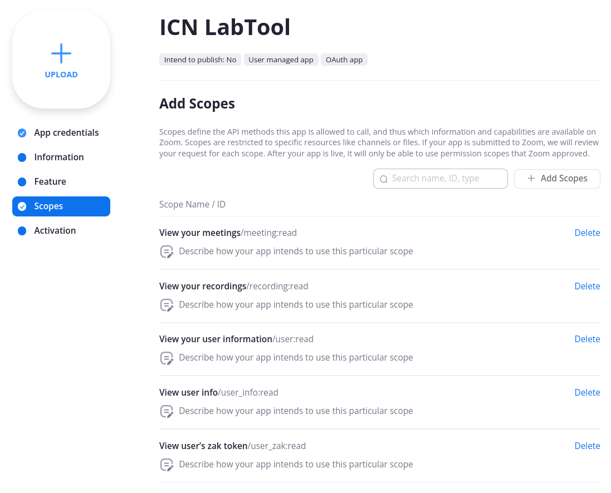
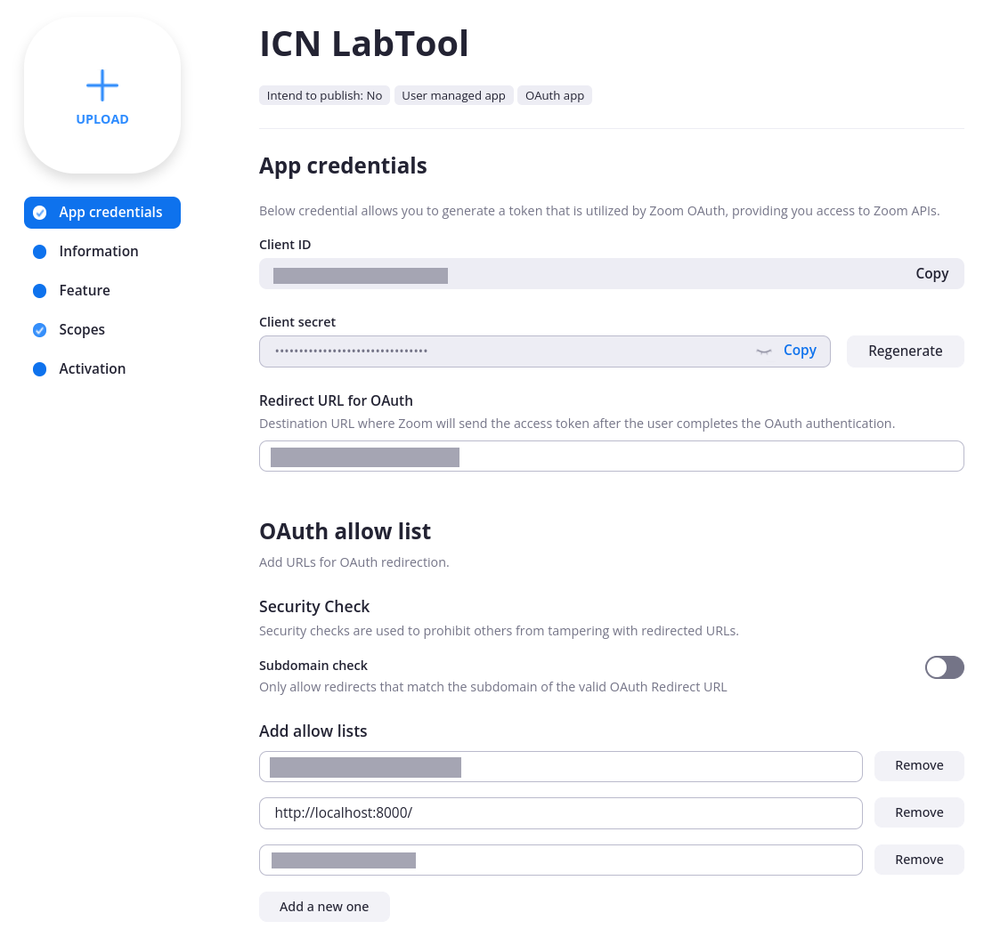

# Zoom recording downloader (ruby CLI)

Ruby script to download zoom cloud recordings to your computer.

## Setup

-   Create your own OAuth app on [App
    Marketplace](https://marketplace.zoom.us/).

    Put `http://localhost:8000/` as an entry of allow lists.

-   Allow your app to view your recordings (`recording:read`).

    

-   Put your app's `CLIENT_ID` and `CLIENT_SECRET` to `config.rb`.
    See `config_sample.rb`.

    

## Usage

```
./zoom-recording-downloader
```

If a file named `token.yaml` does not exist, the script shows the URL
for authentication. In this case, please open the URL and generate the
code and token. The token will be saved to `token.yaml` which should
be kept safe. In this procedure, `http://localhost:8000/` is used as
the return URL.

-   By default, this script downloads all recording files for the last
    two weeks with the naming rule of `%Y%m%d%H%M`.

-   If downloaded files exist, the script does not overwrite them.

-   The script does not download any recorded audio files `m4a`.

-   The script is highly customizable. Enjoy your own way.

## Requirements

- [Curb](https://github.com/taf2/curb) - Libcurl bindings for Ruby
